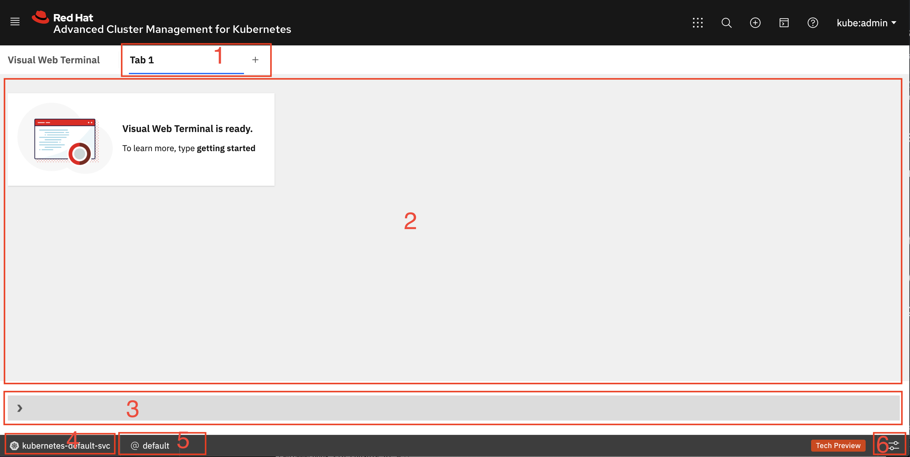
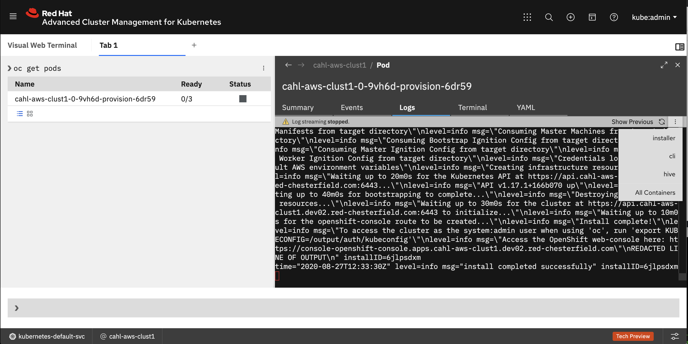

# Visual Web Terminal - A Turbocharged Command Line for Kubernetes and OpenShift

Do you ever get tired of typing `kubectl` and `oc` commands? Tired of cutting and pasting pieces of output to create new `kubectl` and `oc` commands? If you answered yes, take a look at the Visual Web Terminal, included as part of the Red Hat Advanced Cluster Management for Kubernetes console.

Take a look at the following sections to learn more:

* [What is Visual Web Terminal?](#what-is-visual-web-terminal)
* [Getting started with the Visual Web Terminal](#getting-started-with-the-visual-web-terminal)
* [The basic components](#the-basic-components)
* [Advanced features](#advanced-features)
* [Dark mode](#dark-mode)
* [What is next?](#what-is-next)

## What is Visual Web Terminal?

The Visual Web Terminal is a web based terminal session combining command-line function with new interactive features. It is derived from the [Kui](https://github.com/IBM/kui) open source project.

The Visual Web Terminal, located in the product console, is an interface that combines the convenience of a graphical user interface with the speed of a command-line interface. When running a command that returns Kubernetes resources, the data is returned in an interactive table format that can display more detail about the resource when you select it.

In addition to clicking the interactive data, additional options are provided to complete the following tasks:

- View logs
- View and edit YAML
- Search using the integrated `search` API provided in Red Hat Advanced Cluster Management for Kubernetes  

In addition to commands that are specific to the Visual Web Terminal, and selected `bash` commands, the following commands are also supported:

- `kubectl` commands (Or use `k` for even less typing)
- `oc` commands
- `search` commands

## Getting started with the Visual Web Terminal

Access the Visual Web Terminal page by using the Visual Web Terminal icon in the header of the Red Hat Advanced Cluster Management for Kubernetes page. The icon looks like a tiny terminal window with a `>` command prompt.

Click this icon and you are presented with a menu that allows you to launch the page in a new browser tab (best practice) or in the current browser tab.

Now that you have the Visual Web Terminal started, wait a few seconds for it to `oc login` to your hub cluster.

You don't need to worry about downloading and setting up the various command line tools such as `kubectl` or `oc` as they are already included with Visual Web Terminal. Don't worry about **KUBECONFIG**. Visual Web Terminal will use your existing credentials you used to login to the Red Hat Advanced Cluster Management for Kubernetes web console. You'll receive a. You'll receive a **Visual Web Terminal is ready** message when the login and setup is complete.

## The basic components

Now that you have the Visual Web Terminal started, let's take a look at the various areas of the web based terminal session.

### Tabs (1)  
Initially you will have one tab, Tab 1, which equates to a single terminal window session. If you wish to have an additional tab, click the plus sign. Each tab is a unique terminal window session.

### Output Area - Turbocharged! (2)
Your output will be displayed here. Move your mouse pointer over the output to reveal links within the output that are clickable. When you click one of these links, an additional command will be run automatically in the context of the Kubernetes resource you clicked. This is where the turbocharging occurs. Simply point and click and additional commands are run. No typing, no cutting and pasting.

Commands against an individual Kubernetes resource will typically target the output to a split *details* pane to the right of the main output area. This details pane will contain a more graphical view of the resource, including different tabs focusing on different aspects of the resource.

### Command Input Area (3)
Type your commands here. Use the up arrow and down arrow to review history and rerun a command. Typing `history` will bring up a list in the output area that you can click on to rerun the command.

Too much clutter from all those old commands you ran? Would you like to clean up the output area? Type `clear`

### kubectl context (4)
The Kubernetes current context (`kubectl config current-context`). To modify, you can click on this field, view the current choices in the output area and select the choice you want.

### kubectl namespace/oc project (5)
Your default `kubectl` namespace / `oc` project. To modify you can click on this field, view the current choices in the output area and select the choice you want.

### Settings/help/getting started (6)
Bring up the *Settings*, *Help* and *Getting Started* documentation

## Advanced features

### Search across your managed clusters
No need to `oc` login to your various managed clusters to get basic information. The `search` option available in Red Hat Advanced Cluster Management for Kubernetes is accessible from Visual Web Terminal. Start by typing `search` and you are prompted with additional filters that can be applied to the search.

**TIP** You can navigate and select the desired filter prompts with the mouse or directly from the keyboard using the up/down arrow keys to move through the choices and the space bar to select a filter value from the filter prompt. This is the same as on the Search page in the Red Hat Advanced Cluster Management for Kubernetes web console.

- Simple query to find all worker nodes on hub cluster and all managed clusters - `search kind:node role:worker`
- List saved searches - `savedsearches`

### Debugging a Pod

Find the pod you want to debug
- `oc get pods`
- click on the pod you wish to debug
Use the right pane in the output area to perform various tasks listed by tabs:
  - Summary  - a quick high level view of the pod
  - Events - look at events on the pod
  - Logs - See what's in the logs. For pods with multiple containers, use the overflow menu icon (three dots stacked vertically, on the right side of the logs view) to select the specific container
  - Terminal - quickly SSH into the pod to perform additional debug  
  - YAML - quickly see what's in the resource yaml and make changes, if required

## Dark mode

Prefer dark mode? If so you can change the *theme* in one of two ways:
1. Type `theme`, then select `Carbon Gray90` theme
2. Select the `Settings` icon in the lower right, then select `theme`, then select `Carbon Gray90`.

## What is next?

If you need additional information about Visual Web Terminal, please check the Red Hat Advanced Cluster Management for Kubernetes documentation at https://access.redhat.com/documentation/en-us/red_hat_advanced_cluster_management_for_kubernetes/2.0/html/web_console/web-console#visual-web-terminal. To learn more about the entire product, see Red Hat Advanced Cluster Management for Kubernetes [product page](https://www.redhat.com/en/technologies/management/advanced-cluster-management).

We hope you have found a new productivity tool for doing future `kubectl`,  `oc` and `search` commands. We are interested in your feedback and experiences. If you have questions or comments, please contact us at acm-contact@redhat.com.
